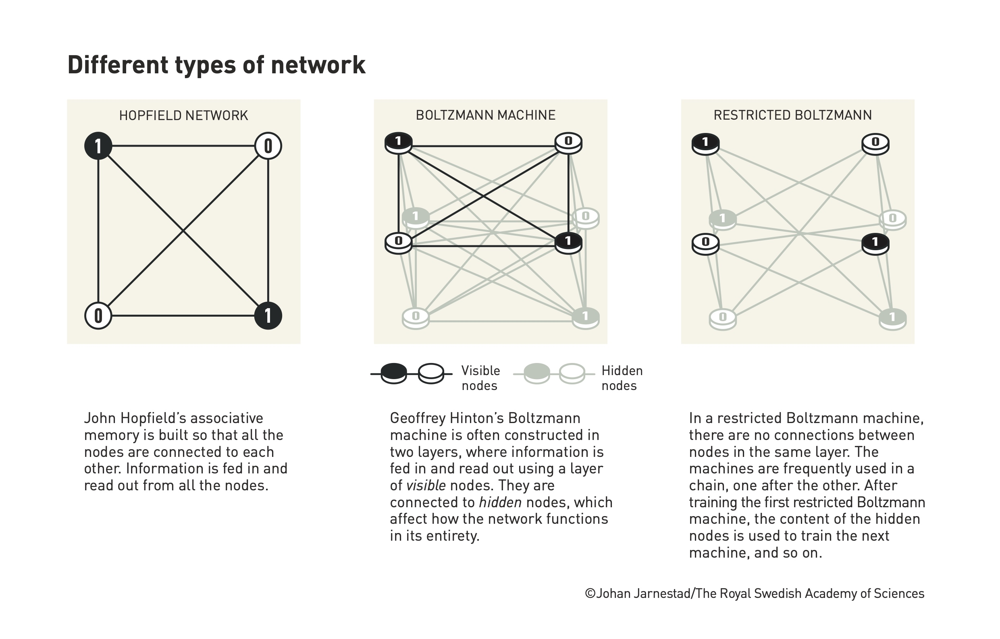
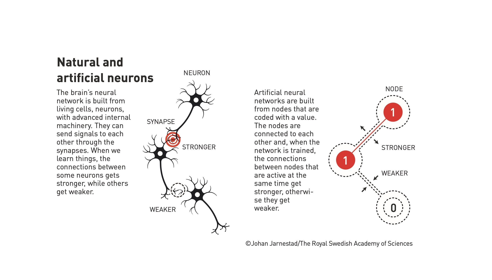
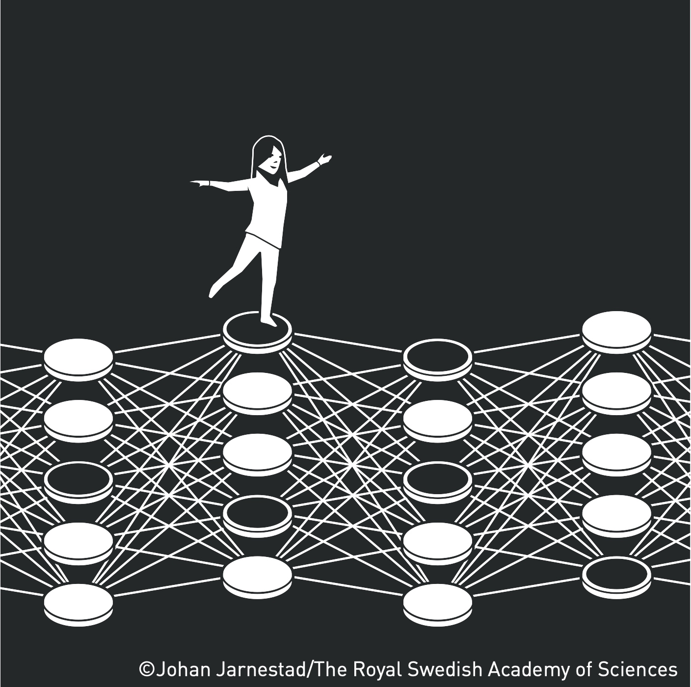

# Session 2 - Deep Learning Evolution and Advanced Neural Network Architectures

This session will explore the transition from foundational neural network models to modern deep learning architectures, focusing on Geoffrey Hinton's contributions, the development of convolutional neural networks (CNNs), and the introduction of transformer models.

## 1. The Rise of Deep Learning

- **Challenges in Training Deep Networks**: During the 1990s and early 2000s, it became clear that training **deep neural networks** (DNNs) was challenging due to issues like the **vanishing gradient problem**.

  - **Vanishing Gradient Problem**: As the network becomes deeper, gradients during backpropagation tend to shrink, making it difficult for weights in earlier layers to update effectively. This issue impeded the training of deep architectures until the introduction of more efficient solutions.

- **Breakthrough with Restricted Boltzmann Machines (RBMs)**: In 2006, **Geoffrey Hinton** introduced a novel approach to train deep networks using **layer-wise pretraining** with RBMs.
  - **Layer-wise Pretraining**: Training one layer at a time using RBMs, followed by fine-tuning with backpropagation, addressed some of the challenges of deep learning, marking a significant milestone in the resurgence of interest in deep networks.
  - 

## 1. Convolutional Neural Networks (CNNs)

- **Introduction to CNNs**: While Geoffrey Hinton's work helped in revitalizing deep learning, **Yann LeCun** and others advanced a special class of neural networks called **convolutional neural networks (CNNs)**.
  - **Architecture Overview**: CNNs are specifically designed for **image recognition** by using convolutional layers that automatically learn spatial hierarchies of features.
    - **Convolutional Layers**: These layers apply **filters** to input images to detect various features like edges, textures, and more complex patterns. This allows CNNs to be effective for vision tasks such as image classification.
  - **Key Milestones**: In the 1990s, CNNs were used for recognizing handwritten digits and subsequently for more complex image recognition tasks in the 2000s.
    - 

## 3. Recurrent Neural Networks and LSTMs

- **Sequential Data Handling**: To address sequential dependencies, **recurrent neural networks (RNNs)** were introduced.
  - **RNN Challenges**: Similar to DNNs, RNNs struggled with long-term dependencies, which prompted the development of **Long Short-Term Memory (LSTM)** networks by **Sepp Hochreiter** and **Jürgen Schmidhuber**.
  - **LSTM Networks**: These networks use special gates to manage the flow of information, allowing them to retain information over longer sequences and overcome the limitations of standard RNNs.

## 1. Transformer Networks

- **The Transformer Revolution**: In 2017, **Vaswani et al.** introduced the **transformer architecture**, a major breakthrough for **natural language processing (NLP)**.
  - **Self-Attention Mechanism**: Transformers leverage a mechanism called **self-attention**, which allows each token in a sequence to attend to all other tokens, thereby effectively capturing long-range dependencies.
    - 
  - **Scalability and Parallelism**: Unlike RNNs, transformers can process sequences in parallel, which significantly reduces training time and makes them highly scalable.
  - **Impact on NLP**: Transformers are the backbone of many state-of-the-art language models, such as **BERT** and **GPT**, which have revolutionized NLP applications like text generation, translation, and question answering.

## 5. Applications and Future Directions

- **Image and Speech Recognition**: CNNs and transformers have become instrumental in various applications:
  - **Image Classification**: CNNs are widely used for object detection, medical imaging, and self-driving car vision systems.
  - **Natural Language Processing**: Transformers power today's most advanced NLP systems, from **chatbots** to **machine translation**.
- **AI Research and Practical Implementations**: Advances in **transformer models** have led to breakthroughs in understanding and generating natural language, providing unprecedented opportunities for AI to deeply interact with human users.

## 6. Key Takeaways

- **Layer-wise Training**: The introduction of **layer-wise training** for deep networks played a key role in overcoming the challenges associated with training deep architectures.
- **CNNs and Transformers**: The development of **convolutional networks** for visual tasks and **transformers** for sequential tasks have solidified the position of neural networks as powerful tools for a broad range of AI applications.
- **Scalability of Transformers**: The parallelism and scalability of transformers have made them the standard for most state-of-the-art AI models today.
